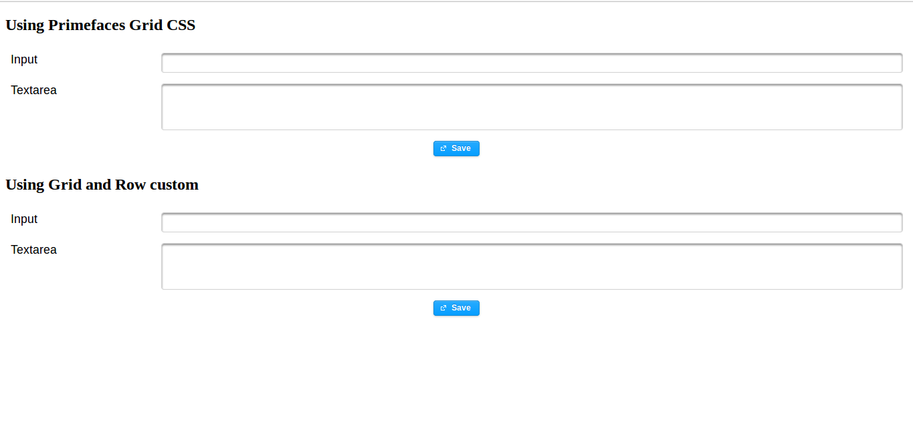

# Create Component for JSF project
Why? Help with divs nested, organize and refactor the code. Here have created two component, grid and row. See index.xhtml

### Grid
Where? (src/main/webapp/resources/x/grid.xhtml
Here we use composite the jsf. See!

### Row
Where? (src/main/webapp/resources/x/row.xhtml
Here we use composite the jsf and for manipulate child component we create RowComponent(src/main/java/br/com/component/RowComponent.java). See!

## RESULT. SEE!

